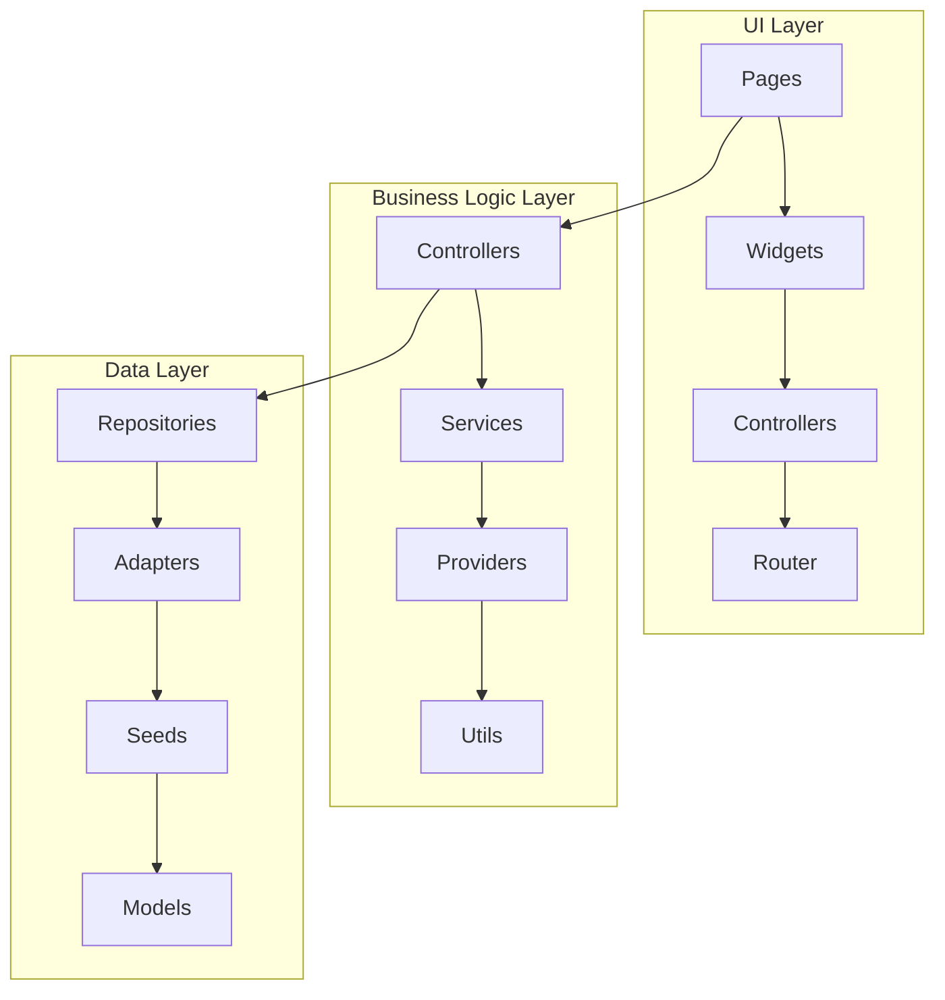
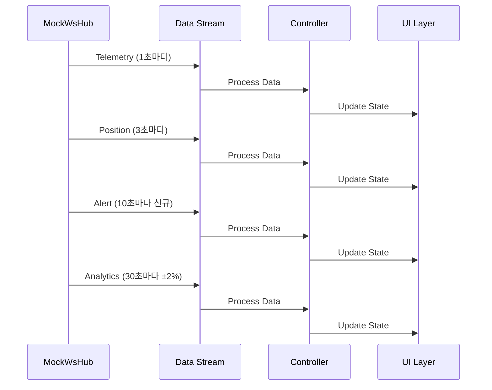
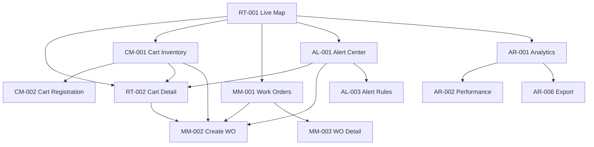

# AproFleet Manager App

**DY Innovate**에서 제조한 **APRO** 골프카트를 위한 종합적인 플리트 관리 시스템입니다. Flutter로 개발된 이 애플리케이션은 실시간 모니터링, 정비 관리, 알림 처리, 분석 기능을 제공합니다.

## 📋 목차

1. [프로젝트 개요](#프로젝트-개요)
2. [아키텍처](#아키텍처)
3. [기능 상세 설명](#기능-상세-설명)
4. [설치 및 실행](#설치-및-실행)
5. [실시간 데이터 흐름](#실시간-데이터-흐름)
6. [네비게이션 매트릭스](#네비게이션-매트릭스)
7. [데이터 모델](#데이터-모델)
8. [테스트](#테스트)
9. [Mock vs Real API 전환](#mock-vs-real-api-전환)
10. [디자인 시스템](#디자인-시스템)
11. [코드 포맷 규칙](#코드-포맷-규칙)
12. [성능 최적화](#성능-최적화)
13. [문제 해결](#문제-해결)
14. [내보내기 기능](#내보내기-기능)
15. [기여 가이드](#기여-가이드)
16. [라이선스 및 크레딧](#라이선스-및-크레딧)

---

## 🎯 프로젝트 개요

### 브랜딩
- **앱 이름**: AproFleet Manager App
- **골프카트 브랜드**: APRO
- **제조사**: DY Innovate
- **용도**: 골프카트 플리트 관리 시스템

### 다국어 지원
이 애플리케이션은 다음 언어를 지원합니다:
- **영어** (English)
- **일본어** (日本語)
- **한국어** (한국어)

언어 전환은 설정 메뉴에서 가능합니다.

### 디자인 시스템
- **테마**: 다크 테마 (올블랙 배경)
- **컬러 팔레트**: 모노크롬 기반
- **타이포그래피**: 대문자, letter-spacing 적용
- **UI 스타일**: 전문적이고 미니멀한 디자인

### 주요 기능 개요
8개의 핵심 페이지로 구성된 모듈식 아키텍처:

| 모듈 | 페이지 ID | 페이지명 | 우선순위 |
|------|-----------|----------|----------|
| **RT** | RT-001 | Live Map View | P1 |
| **RT** | RT-002 | Cart Detail Monitor | P1 |
| **CM** | CM-001 | Cart Inventory List | P1 |
| **CM** | CM-002 | Cart Registration | P1 |
| **MM** | MM-001 | Work Order List | P1 |
| **MM** | MM-002 | Create Work Order | P1 |
| **AL** | AL-001 | Alert Center | P1 |
| **AR** | AR-001 | Analytics Dashboard | P1 |

---

## 🏗️ 아키텍처

### 레이어 구조



### 폴더 구조

```
lib/
├── app.dart                          # 앱 진입점
├── router/
│   └── app_router.dart               # 라우팅 설정
├── theme/
│   └── app_theme.dart                # 테마 설정
├── core/
│   ├── constants/
│   │   └── app_constants.dart        # 상수 정의
│   ├── localization/
│   │   ├── app_localizations.dart    # 다국어 기본 클래스
│   │   ├── app_localizations_en.dart # 영어 번역
│   │   ├── app_localizations_ja.dart # 일본어 번역
│   │   └── app_localizations_ko.dart # 한국어 번역
│   ├── services/
│   │   ├── providers.dart            # Riverpod 프로바이더
│   │   ├── mock/
│   │   │   ├── mock_api.dart         # Mock API 서비스
│   │   │   ├── mock_ws_hub.dart      # Mock WebSocket 허브
│   │   │   └── seeds/                # 시드 데이터
│   │   └── repositories/             # 리포지토리 인터페이스
│   ├── utils/
│   │   ├── code_formatters.dart      # 코드 포맷터
│   │   └── kpi_calculator.dart       # KPI 계산기
│   ├── widgets/
│   │   ├── navigation_bar.dart       # 하단 네비게이션
│   │   ├── shared_widgets.dart       # 공통 위젯
│   │   ├── status_bar.dart           # 상태바
│   │   ├── filter_sheet.dart         # 필터 시트
│   │   ├── steps/
│   │   │   └── stepper.dart          # 스테퍼 위젯
│   │   └── qr/
│   │       └── qr_label.dart         # QR 라벨 생성
│   └── services/
│       └── map/
│           └── canvas_map_view.dart  # 캔버스 맵 뷰
├── domain/
│   └── models/                       # Freezed 모델
│       ├── cart.dart
│       ├── work_order.dart
│       ├── alert.dart
│       ├── telemetry.dart
│       ├── kpi.dart
│       └── user_profile.dart
└── features/
    ├── rt/                           # Real-Time 모듈
    │   ├── pages/
    │   │   ├── live_map_view.dart    # RT-001
    │   │   └── cart_detail_monitor.dart # RT-002
    │   └── controllers/
    │       └── live_map_controller.dart
    ├── cm/                           # Cart Management 모듈
    │   ├── pages/
    │   │   ├── cart_inventory_list.dart # CM-001
    │   │   └── cart_registration.dart    # CM-002
    │   └── controllers/
    │       └── cart_inventory_controller.dart
    ├── mm/                           # Maintenance 모듈
    │   ├── pages/
    │   │   ├── work_order_list.dart  # MM-001
    │   │   └── create_work_order.dart    # MM-002
    │   ├── controllers/
    │   │   └── work_order_controller.dart
    │   └── widgets/
    │       ├── wo_card.dart
    │       ├── wo_timeline.dart
    │       └── wo_detail_modal.dart
    ├── al/                           # Alerts 모듈
    │   ├── pages/
    │   │   └── alert_center.dart     # AL-001
    │   ├── controllers/
    │   │   └── alert_controller.dart
    │   └── widgets/
    │       ├── alert_card.dart
    │       ├── alert_filters.dart
    │       ├── alert_detail_modal.dart
    │       └── alert_rules_panel.dart
    └── ar/                           # Analytics 모듈
        ├── pages/
        │   └── analytics_dashboard.dart # AR-001
        ├── controllers/
        │   └── analytics_controller.dart
        └── widgets/
            ├── kpi_card.dart
            ├── charts/
            │   ├── fleet_performance_bar.dart
            │   ├── battery_health_line.dart
            │   └── maintenance_pie.dart
            └── export_modal.dart
```

### 상태 관리
- **Riverpod**: Provider 기반 상태 관리
- **StateNotifier**: 반응형 상태 업데이트
- **AsyncValue**: 로딩, 에러, 데이터 상태 관리
- **Selectors**: 세밀한 리빌드 최적화

### 라우팅
- **go_router**: 선언적 라우팅
- **딥링크**: 알림→카트 상세, 카트→작업 지시 생성 등
- **크로스 모듈**: 모듈 간 네비게이션 지원

---

## 🔧 기능 상세 설명

### RT (Real-Time) 모듈

#### RT-001 Live Map View
**실시간 골프코스 맵 뷰**

주요 기능:
- **캔버스 기반 맵**: SVG/Canvas로 구현된 골프코스 맵
- **실시간 위치 추적**: 12대 카트의 실시간 위치 표시
- **상태별 색상 구분**:
  - 🟢 Active (운행중) - 초록색
  - 🟠 Idle (대기중) - 주황색  
  - 🔵 Charging (충전중) - 파란색
  - 🔴 Maintenance (정비중) - 빨간색
  - ⚫ Offline (오프라인) - 회색
- **줌/필터 기능**: 줌 인/아웃, 상태별 필터링
- **카트 상세 팝업**: 마커 클릭 시 텔레메트리 정보 표시
- **실시간 상태 패널**: 하단 상태바에 전체 카트 현황

#### RT-002 Cart Detail Monitor
**개별 카트 상세 모니터링**

주요 기능:
- **실시간 텔레메트리**: 배터리, 속도, 위치, 온도, 전압, 전류
- **시각적 게이지**: 배터리 잔량, 속도계, 온도계
- **원격 제어 기능**:
  - Speed Limit: 속도 제한 설정
  - Message: 운전자에게 메시지 전송
  - Return to Base: 기지 복귀 명령
  - Lock Cart: 카트 원격 잠금
  - EMERGENCY STOP: 긴급 정지
- **알림 시스템**: 배터리 50% 이하 시 경고 표시
- **미니맵**: 실시간 위치 추적

### CM (Cart Management) 모듈

#### CM-001 Cart Inventory List
**카트 재고 목록 관리**

주요 기능:
- **검색 및 필터링**: ID, 모델명, 위치로 검색
- **고급 필터**:
  - Status: Active, Idle, Charging, Maintenance, Offline
  - Model: EZ-GO, Club Car, Yamaha
  - Battery Level: <20%, 20-50%, 50-80%, >80%
- **뷰 모드 전환**: List View, Grid View, Select Mode
- **통계 바**: Total, Active, Service, Charging 카운트
- **개별 카트 액션**: Details, Track, Service
- **일괄 작업**: 다중 선택, 일괄 배정, 정비 요청

#### CM-002 Cart Registration
**신규 카트 등록**

주요 기능:
- **4단계 등록 프로세스**:
  1. Basic (기본 정보)
  2. Technical (기술 사양)
  3. Components (구성품)
  4. Review (검토)
- **자동 ID 생성**: GCA-029 형식
- **QR 코드 생성**: 카트별 고유 QR 코드
- **이미지 업로드**: 카트 사진 촬영/업로드
- **구성품 등록**: 배터리, 모터, 타이어 등 시리얼 번호
- **유효성 검증**: 실시간 입력 확인

### MM (Maintenance) 모듈

#### MM-001 Work Order List
**작업 지시서 목록 관리**

주요 기능:
- **작업 지시 통계**: Urgent, Pending, In Progress, Today
- **필터 탭**: All, Urgent, Pending, In Progress, Completed, Timeline
- **우선순위 표시**:
  - P1 (Critical): 빨간색 - 긴급 대응
  - P2 (High): 주황색 - 높은 우선순위
  - P3 (Normal): 파란색 - 일반 작업
  - P4 (Low): 초록색 - 낮은 우선순위
- **타임라인 뷰**: 시간순 작업 이력
- **작업 지시 상세 모달**: 체크리스트, 부품 목록, 상태 업데이트
- **기술자 정보**: 아바타, 담당자명, 미배정 상태

#### MM-002 Create Work Order
**작업 지시서 생성**

주요 기능:
- **4단계 생성 마법사**:
  1. Type & Priority (유형 및 우선순위)
  2. Cart & Location (카트 및 위치)
  3. Schedule & Technician (일정 및 기술자)
  4. Parts & Review (부품 및 검토)
- **QR 스캔**: 카트 ID 자동 인식
- **자동 우선순위**: 작업 유형에 따른 우선순위 자동 설정
- **부품 제안**: 작업 유형별 자동 부품 제안
- **기술자 배정**: 가용 상태, 작업량 표시
- **드래프트 저장**: 임시 저장 기능

### AL (Alerts) 모듈

#### AL-001 Alert Center
**알림 센터**

주요 기능:
- **알림 요약 대시보드**: Critical, Warning, Info, Resolved
- **알림 필터**: All, Unread, Cart, Battery, Maintenance, Geofence, System
- **심각도별 색상**:
  - Critical 🛑: Emergency Stop, Critical Battery
  - Warning ⚠️: Geofence Violation, Maintenance Due
  - Info ℹ️: Temperature Warning, System Updates
  - Success ✅: Completed Tasks
- **알림 상세 모달**: 에스컬레이션 경로, 액션 히스토리
- **실시간 기능**: 10초마다 새 알림, 5초마다 상태 업데이트
- **설정 패널**: Alert Rules, Notifications, Escalation Matrix

### AR (Analytics) 모듈

#### AR-001 Analytics Dashboard
**분석 대시보드**

주요 기능:
- **기간 선택**: Today, This Week, This Month, Quarter, Year, Custom
- **핵심 KPI 카드**:
  - Availability Rate: 가동률 (94.8%)
  - MTTR: 평균 수리 시간 (18분)
  - Daily Utilization: 일일 활용도 (847km)
- **차트 시각화**:
  - Fleet Performance (막대 차트)
  - Battery Health Trend (라인 차트)
  - Maintenance Distribution (파이 차트)
  - Cost Analysis (비교 그리드)
- **내보내기 기능**: PDF Report, Excel Spreadsheet, CSV Data
- **실시간 업데이트**: 30초마다 메트릭 업데이트

---

## 🚀 설치 및 실행

### 사전 요구사항
- **Flutter SDK**: 3.0 이상
- **Dart SDK**: 3.0 이상
- **iOS Simulator** 또는 **Android Emulator**
- **Xcode** (iOS 개발용)
- **Android Studio** (Android 개발용)

### 설치 과정

1. **저장소 클론**
   ```bash
   git clone <repository-url>
   cd aprofleet_manager_app
   ```

2. **의존성 설치**
   ```bash
   flutter pub get
   ```

3. **코드 생성**
   ```bash
   dart run build_runner build --delete-conflicting-outputs
   ```

4. **앱 실행**
   ```bash
   flutter run
   ```

### 개발 모드
- **핫 리로드**: `r` 키로 핫 리로드
- **핫 리스타트**: `R` 키로 핫 리스타트
- **디버그 옵션**: `d` 키로 디버그 메뉴 열기

### 권한 설정

#### iOS (`ios/Runner/Info.plist`)
```xml
<key>NSCameraUsageDescription</key>
<string>이 앱은 카트 식별을 위한 QR 코드 스캔에 카메라 접근이 필요합니다.</string>
<key>NSPhotoLibraryUsageDescription</key>
<string>이 앱은 카트 이미지 업로드를 위해 사진 라이브러리 접근이 필요합니다.</string>
```

#### Android (`android/app/src/main/AndroidManifest.xml`)
```xml
<uses-permission android:name="android.permission.CAMERA" />
<uses-permission android:name="android.permission.READ_EXTERNAL_STORAGE" />
<uses-permission android:name="android.permission.WRITE_EXTERNAL_STORAGE" />
```

---

## 📡 실시간 데이터 흐름

### MockWsHub 시뮬레이션 타이머



### 업데이트 간격
- **텔레메트리**: 1초마다 업데이트
- **위치**: 3초마다 업데이트
- **알림**: 10초마다 신규 알림, 5초마다 상태 변경
- **분석**: 30초마다 KPI ±2% 변동

### 스트림 구조
```dart
class MockWsHub {
  Stream<Telemetry> get telemetryStream => _telemetryController.stream;
  Stream<Position> get positionStream => _positionController.stream;
  Stream<Alert> get alertStream => _alertController.stream;
  
  void _startSimulation() {
    Timer.periodic(Duration(seconds: 1), (_) {
      _telemetryController.add(_generateTelemetry());
    });
  }
}
```

---

## 🗺️ 네비게이션 매트릭스

### 페이지 간 이동 플로우



### 딥링크 매핑
- **알림→카트 상세**: `context.go('/rt/cart/${alert.cartId}')`
- **알림→작업 지시**: `context.go('/mm/create?cart=${alert.cartId}&type=${mappedType}')`
- **카트→작업 지시**: `context.go('/mm/create?cart=${cart.id}')`
- **카트→추적**: `context.go('/rt/cart/${cart.id}')`

### 크로스 모듈 통합
- **긴급 대응 플로우**: Alert → Cart Detail → Create WO → Track Progress
- **정기 점검 플로우**: Calendar → Select Cart → Checklist → Update History
- **배터리 관리 플로우**: Battery Status → Location → Reassign → Notify

---

## 📊 데이터 모델

### Freezed 모델 구조

#### Cart 모델
```dart
@freezed
class Cart with _$Cart {
  const factory Cart({
    required String id,
    required String model,
    required CartStatus status,
    required double batteryPct,
    required double speedKph,
    required LatLng position,
    required DateTime lastSeenAt,
    String? location,
    String? operator,
    Map<String, double>? dailyDistanceKm,
    double? operatingHours,
    double? downtimeHours,
  }) = _Cart;

  factory Cart.fromJson(Map<String, dynamic> json) => _$CartFromJson(json);
}
```

#### WorkOrder 모델
```dart
@freezed
class WorkOrder with _$WorkOrder {
  const factory WorkOrder({
    required String id,
    required WorkOrderType type,
    required Priority priority,
    required String cartId,
    required String description,
    required WorkOrderStatus status,
    required DateTime createdAt,
    required DateTime updatedAt,
    String? location,
    DateTime? scheduledAt,
    Duration? estimatedDuration,
    String? technician,
    List<WoPart>? parts,
    Map<String, bool>? checklist,
    String? notes,
    DateTime? completedAt,
  }) = _WorkOrder;

  factory WorkOrder.fromJson(Map<String, dynamic> json) => _$WorkOrderFromJson(json);
}
```

#### Alert 모델
```dart
@freezed
class Alert with _$Alert {
  const factory Alert({
    required String id,
    required String code,
    required AlertSeverity severity,
    required Priority priority,
    required AlertState state,
    required String title,
    required String message,
    String? cartId,
    String? location,
    required DateTime createdAt,
    required DateTime updatedAt,
    List<AlertAction>? actions,
    int? escalationLevel,
    DateTime? acknowledgedAt,
    String? acknowledgedBy,
    String? resolvedBy,
    DateTime? resolvedAt,
    String? notes,
  }) = _Alert;

  factory Alert.fromJson(Map<String, dynamic> json) => _$AlertFromJson(json);
}
```

### JSON 직렬화 예시
```dart
// Cart 객체를 JSON으로 변환
final cart = Cart(
  id: 'GCA-001',
  model: 'APRO-X',
  status: CartStatus.active,
  batteryPct: 85.0,
  speedKph: 15.0,
  position: LatLng(37.5665, 126.9780),
  lastSeenAt: DateTime.now(),
);

final json = cart.toJson();
print(json);
// {
//   "id": "GCA-001",
//   "model": "APRO-X",
//   "status": "active",
//   "batteryPct": 85.0,
//   "speedKph": 15.0,
//   "position": {"lat": 37.5665, "lng": 126.9780},
//   "lastSeenAt": "2025-01-27T10:30:00.000Z"
// }
```

### 시드 데이터
- **12개 카트**: GCA-001 ~ GCA-012 (다양한 상태와 배터리 레벨)
- **10개 작업 지시서**: WO-2025-0001 ~ 0010 (모든 우선순위 레벨)
- **8개 알림**: ALT-2025-0001 ~ 0008 (다양한 심각도와 상태)
- **기술자**: 8명의 기술자 (다양한 기술 수준)
- **부품 카탈로그**: 12개 부품 (SKU 및 가격 정보)

---

## 🧪 테스트

### 단위 테스트 (3개)

#### 1. KPI 계산기 테스트
```dart
// test/kpi_calculator_test.dart
void main() {
  group('KpiCalculator', () {
    test('Availability: clamps to [0,100] and handles zero downtime', () {
      // 가동률 계산 테스트
      final kpi = KpiCalculator.fromSamples(
        carts: [cart],
        workOrders: [],
        telemetrySamples: [],
      );
      expect(kpi.availabilityRate, 100);
    });

    test('MTTR: guards divide-by-zero and uses completed repairs only', () {
      // 평균 수리 시간 계산 테스트
      final kpi = KpiCalculator.fromSamples(
        carts: [],
        workOrders: [completedWorkOrder],
        telemetrySamples: [],
      );
      expect(kpi.mttrMinutes, 90);
    });

    test('Range filtering affects aggregates deterministically', () {
      // 범위 필터링 테스트
      final weekKpi = KpiCalculator.fromSamples(
        carts: carts,
        workOrders: [],
        telemetrySamples: [],
        startDate: now.subtract(Duration(days: 7)),
        endDate: now,
      );
      expect(weekKpi.utilizationKm, expectedWeekDistance);
    });
  });
}
```

#### 2. 우선순위 큐 테스트
```dart
// test/priority_queue_test.dart
void main() {
  group('AlertPriorityQueue', () {
    test('Orders by P1..P4 then newest-first within same priority', () {
      final pq = AlertPriorityQueue();
      pq.addAll([aP4Old, aP1Old, aP1New, aP2New]);
      
      expect(pq.removeFirst().id, aP1New.id); // P1, newest
      expect(pq.removeFirst().id, aP1Old.id); // P1, older
      expect(pq.removeFirst().id, aP2New.id); // P2
      expect(pq.removeFirst().id, aP4Old.id); // P4
    });

    test('Acknowledged/Resolved remain in queue with preserved ordering rules', () {
      // 확인/해결된 알림도 큐에 유지되는지 테스트
      final pq = AlertPriorityQueue();
      pq.addAll([aP3Resolved, aP2Acknowledged, aP1Triggered]);
      
      final list = pq.toList();
      expect(list[0].id, aP1Triggered.id); // P1 triggered first
      expect(list[1].id, aP2Acknowledged.id); // P2 acknowledged second
      expect(list[2].id, aP3Resolved.id); // P3 resolved last
    });
  });
}
```

#### 3. 코드 포맷터 테스트
```dart
// test/code_formatter_test.dart
void main() {
  group('CodeFormatters', () {
    test('WorkOrderIdFormatter WO-YYYY-#### zero-pads and increments within year', () {
      final f = WorkOrderIdFormatter(seedYear: 2025, seedCounter: 42);
      expect(f.next(), 'WO-2025-0043');
      expect(f.next(), 'WO-2025-0044');
    });

    test('AlertCodeFormatter ALT-2025-#### maintains separate space from WO', () {
      final alt = AlertCodeFormatter(seedYear: 2025, seedCounter: 9);
      expect(alt.next(), 'ALT-2025-0010');
      expect(alt.next(), 'ALT-2025-0011');
    });
  });
}
```

### 위젯 테스트 (2개)

#### 1. 알림 센터 리스트 테스트
```dart
// test/alert_center_list_test.dart
void main() {
  group('AlertCenterPage Widget Tests', () {
    testWidgets('Filters apply and ack changes state', (tester) async {
      await tester.pumpWidget(
        ProviderScope(
          overrides: [
            alertRepositoryProvider.overrideWithValue(mockAlertRepository),
          ],
          child: MaterialApp(home: AlertCenterPage()),
        ),
      );
      
      // 초기 상태 확인: 3개 알림 표시
      expect(find.byType(AlertCard), findsNWidgets(3));
      
      // "Battery" 필터 탭
      await tester.tap(find.text('Battery'));
      await tester.pumpAndSettle();
      
      // "Battery Low"만 표시되어야 함
      expect(find.byType(AlertCard), findsOneWidget);
      expect(find.text('Battery Low'), findsOneWidget);
      
      // 첫 번째 카드 확인 처리
      await tester.tap(find.byKey(Key('alert_action_A001_acknowledge')));
      await tester.pumpAndSettle();
      
      // 상태 변경 확인
      expect(find.textContaining('ACKNOWLEDGED'), findsOneWidget);
    });
  });
}
```

#### 2. 작업 지시 생성 폼 테스트
```dart
// test/create_wo_form_test.dart
void main() {
  group('CreateWorkOrder Widget Tests', () {
    testWidgets('Step validation and auto-priority by type', (tester) async {
      await tester.pumpWidget(
        ProviderScope(
          overrides: [
            cartRepositoryProvider.overrideWithValue(mockCartRepository),
            workOrderRepositoryProvider.overrideWithValue(mockWorkOrderRepository),
          ],
          child: MaterialApp(home: CreateWorkOrderPage()),
        ),
      );
      
      // Step 1: Type & Priority
      // Next 버튼이 비활성화되어 있어야 함
      expect(tester.widget<ElevatedButton>(find.widgetWithText(ElevatedButton, 'Next')).enabled, isFalse);
      
      // "Battery Service" 선택 → P2 자동 설정
      await tester.tap(find.text('Battery'));
      await tester.pump();
      expect(find.text('Priority: P2'), findsOneWidget);
      
      // 설명 입력 (최소 10자)
      await tester.enterText(find.byKey(const Key('wo.description_field')), 'Replace low battery pack');
      await tester.pump();
      
      // Next 버튼이 활성화되어야 함
      expect(tester.widget<ElevatedButton>(find.widgetWithText(ElevatedButton, 'Next')).enabled, isTrue);
    });
  });
}
```

### 테스트 실행
```bash
# 모든 테스트 실행
flutter test

# 특정 테스트 파일 실행
flutter test test/kpi_calculator_test.dart

# 테스트 커버리지 생성
flutter test --coverage
```

---

## 🔄 Mock vs Real API 전환

### Provider 오버라이드 전략

#### 1. Main App 설정 업데이트
```dart
// lib/main.dart
void main() {
  runApp(ProviderScope(
    overrides: [
      // Mock 리포지토리를 실제 구현으로 교체
      cartRepositoryProvider.overrideWithValue(
        RestCartRepository(httpClient),
      ),
      workOrderRepositoryProvider.overrideWithValue(
        RestWoRepository(httpClient),
      ),
      alertRepositoryProvider.overrideWithValue(
        RestAlertRepository(wsClient),
      ),
      analyticsRepositoryProvider.overrideWithValue(
        RestAnalyticsRepository(httpClient),
      ),
    ],
    child: const App(),
  ));
}
```

#### 2. 환경별 설정
```dart
// lib/core/config/environment.dart
enum Environment { development, staging, production }

class AppConfig {
  static Environment get current => 
      const String.fromEnvironment('ENV', defaultValue: 'development') == 'production'
          ? Environment.production
          : Environment.development;
  
  static List<Override> get providerOverrides {
    switch (current) {
      case Environment.development:
        return []; // Mock 프로바이더 사용
      case Environment.staging:
        return _stagingOverrides;
      case Environment.production:
        return _productionOverrides;
    }
  }
}
```

### REST API 엔드포인트

#### Cart 엔드포인트
```dart
class RestCartRepository implements CartRepository {
  final HttpClient httpClient;
  
  @override
  Future<List<Cart>> list({CartFilter? filter}) async {
    final queryParams = _buildQueryParams(filter);
    final response = await httpClient.get(
      Uri.parse('$baseUrl/carts?$queryParams'),
      headers: await _getHeaders(),
    );
    
    if (response.statusCode == 200) {
      final json = jsonDecode(response.body) as List;
      return json.map((e) => Cart.fromJson(e)).toList();
    }
    
    throw CartRepositoryException('Failed to fetch carts: ${response.statusCode}');
  }
}
```

**API 엔드포인트:**
- `GET /carts` - 카트 목록 조회 (필터링 지원)
- `GET /carts/:id` - 특정 카트 조회
- `POST /carts` - 새 카트 생성
- `PUT /carts/:id` - 카트 정보 업데이트
- `DELETE /carts/:id` - 카트 삭제

#### Work Order 엔드포인트
**API 엔드포인트:**
- `GET /work-orders` - 작업 지시서 목록 조회
- `GET /work-orders/:id` - 특정 작업 지시서 조회
- `POST /work-orders` - 새 작업 지시서 생성
- `PUT /work-orders/:id` - 작업 지시서 업데이트
- `PATCH /work-orders/:id/status` - 작업 지시서 상태 업데이트
- `DELETE /work-orders/:id` - 작업 지시서 삭제

#### Alert 엔드포인트
**API 엔드포인트:**
- `GET /alerts` - 알림 목록 조회
- `GET /alerts/:id` - 특정 알림 조회
- `POST /alerts/:id/acknowledge` - 알림 확인 처리
- `POST /alerts/:id/escalate` - 알림 에스컬레이션
- `POST /alerts/:id/resolve` - 알림 해결 처리
- `POST /alerts/mark-all-read` - 모든 알림 읽음 처리
- `PATCH /alerts/mute` - 알림 음소거 토글

### WebSocket 통합

#### 실시간 데이터 스트림
```dart
class WebSocketAlertRepository implements AlertRepository {
  final WebSocketChannel channel;
  final StreamController<Alert> _alertController = StreamController.broadcast();
  
  WebSocketAlertRepository(this.channel) {
    _setupWebSocket();
  }
  
  void _setupWebSocket() {
    channel.stream.listen((data) {
      final event = jsonDecode(data);
      switch (event['type']) {
        case 'alert_created':
          _alertController.add(Alert.fromJson(event['data']));
          break;
        case 'alert_updated':
          _alertController.add(Alert.fromJson(event['data']));
          break;
      }
    });
  }
  
  @override
  Stream<Alert> live() => _alertController.stream;
}
```

**WebSocket 이벤트:**
- `telemetry_update` - 실시간 텔레메트리 데이터
- `position_update` - 카트 위치 업데이트
- `alert_created` - 새 알림 생성
- `alert_updated` - 알림 상태 변경
- `work_order_updated` - 작업 지시서 상태 변경

### 인증

#### 토큰 관리
```dart
class AuthTokenManager {
  String? _accessToken;
  String? _refreshToken;
  DateTime? _expiresAt;
  
  Future<String> getValidToken() async {
    if (_accessToken != null && _expiresAt != null && DateTime.now().isBefore(_expiresAt!)) {
      return _accessToken!;
    }
    
    if (_refreshToken != null) {
      await _refreshAccessToken();
      return _accessToken!;
    }
    
    throw AuthenticationException('No valid token available');
  }
  
  Future<void> _refreshAccessToken() async {
    final response = await httpClient.post(
      Uri.parse('$baseUrl/auth/refresh'),
      headers: {'Authorization': 'Bearer $_refreshToken'},
    );
    
    if (response.statusCode == 200) {
      final data = jsonDecode(response.body);
      _accessToken = data['access_token'];
      _expiresAt = DateTime.now().add(Duration(seconds: data['expires_in']));
    } else {
      throw AuthenticationException('Token refresh failed');
    }
  }
}
```

### 환경 설정

#### 환경 변수
```dart
class ApiConfig {
  static String get baseUrl => const String.fromEnvironment(
    'API_BASE_URL',
    defaultValue: 'https://api.aprofleet.com',
  );
  
  static String get wsUrl => const String.fromEnvironment(
    'WS_BASE_URL',
    defaultValue: 'wss://ws.aprofleet.com',
  );
  
  static Duration get timeout => Duration(
    seconds: const int.fromEnvironment('API_TIMEOUT', defaultValue: 30),
  );
  
  static int get maxRetries => const int.fromEnvironment('API_MAX_RETRIES', defaultValue: 3);
}
```

---

## 🎨 디자인 시스템

### 컬러 토큰

#### 배경 색상
```dart
class AppColors {
  // Primary backgrounds
  static const Color primaryBackground = Color(0xFF000000);      // 순수 검정
  static const Color secondaryBackground = Color(0xFF0A0A0A);   // 어두운 회색
  static const Color surfaceBackground = Color(0xFF1A1A1A);     // 카드 배경
  
  // Border colors
  static const Color borderPrimary = Color(0x1FFFFFFF);         // 12% 투명도 흰색
  static const Color borderSecondary = Color(0x0DFFFFFF);      // 5% 투명도 흰색
  static const Color borderAccent = Color(0x33FFFFFF);         // 20% 투명도 흰색
}
```

#### 우선순위 색상
```dart
class PriorityColors {
  static const Color p1 = Color(0xFFEF4444);  // 빨강 - Critical/Emergency
  static const Color p2 = Color(0xFFF97316);  // 주황 - High Priority
  static const Color p3 = Color(0xFF3B82F6);   // 파랑 - Medium Priority
  static const Color p4 = Color(0xFF22C55E);   // 초록 - Low Priority
}
```

#### 알림 심각도 색상
```dart
class AlertColors {
  static const Color critical = Color(0xFFEF4444);  // 빨강
  static const Color warning = Color(0xFFF97316);   // 주황
  static const Color info = Color(0xFF3B82F6);     // 파랑
  static const Color success = Color(0xFF22C55E);  // 초록
}
```

#### 상태 색상
```dart
class StatusColors {
  static const Color active = Color(0xFF22C55E);      // 초록
  static const Color idle = Color(0xFF6B7280);        // 회색
  static const Color charging = Color(0xFF3B82F6);    // 파랑
  static const Color maintenance = Color(0xFFF97316); // 주황
  static const Color offline = Color(0xFFEF4444);     // 빨강
}
```

### 타이포그래피

#### 폰트 패밀리
- **Primary**: SF Pro Display (iOS) / Roboto (Android)
- **Monospace**: SF Mono (iOS) / Roboto Mono (Android)

#### 텍스트 스타일
```dart
class AppTextStyles {
  // Headers
  static const TextStyle h1 = TextStyle(
    fontSize: 32,
    fontWeight: FontWeight.w700,
    letterSpacing: 1.2,
    color: Colors.white,
  );
  
  static const TextStyle h2 = TextStyle(
    fontSize: 24,
    fontWeight: FontWeight.w600,
    letterSpacing: 1.0,
    color: Colors.white,
  );
  
  // Body text
  static const TextStyle bodyLarge = TextStyle(
    fontSize: 16,
    fontWeight: FontWeight.w400,
    color: Colors.white,
  );
  
  // Labels
  static const TextStyle labelLarge = TextStyle(
    fontSize: 14,
    fontWeight: FontWeight.w600,
    letterSpacing: 0.5,
    color: Colors.white,
  );
  
  // KPI/Numeric
  static const TextStyle kpiLarge = TextStyle(
    fontSize: 24,
    fontWeight: FontWeight.w700,
    fontFeatures: [FontFeature.tabularFigures()],
    color: Colors.white,
  );
}
```

### 간격 시스템

#### 기본 단위
- **Base**: 4px
- **Scale**: 4, 8, 12, 16, 20, 24, 32, 40, 48, 64, 80, 96

#### 간격 토큰
```dart
class AppSpacing {
  static const double xs = 4.0;    // 0.25rem
  static const double sm = 8.0;    // 0.5rem
  static const double md = 12.0;   // 0.75rem
  static const double lg = 16.0;   // 1rem
  static const double xl = 20.0;   // 1.25rem
  static const double xxl = 24.0;  // 1.5rem
  static const double xxxl = 32.0; // 2rem
}
```

### 보더 반경

#### 보더 반경 토큰
```dart
class AppBorderRadius {
  static const double none = 0.0;
  static const double xs = 4.0;
  static const double sm = 8.0;
  static const double md = 12.0;
  static const double lg = 16.0;
  static const double xl = 20.0;
  static const double xxl = 24.0;
  static const double full = 9999.0;
}
```

#### 컴포넌트별 보더 반경
```dart
class ComponentBorderRadius {
  // Cards
  static const BorderRadius card = BorderRadius.all(Radius.circular(12));
  
  // Buttons
  static const BorderRadius button = BorderRadius.all(Radius.circular(8));
  
  // Chips/Badges
  static const BorderRadius chip = BorderRadius.all(Radius.circular(16));
}
```

### 그림자

#### 그림자 토큰
```dart
class AppShadows {
  static const BoxShadow z1 = BoxShadow(
    color: Color(0x1A000000),
    blurRadius: 4,
    offset: Offset(0, 2),
  );
  
  static const BoxShadow z2 = BoxShadow(
    color: Color(0x1A000000),
    blurRadius: 8,
    offset: Offset(0, 4),
  );
  
  static const BoxShadow z3 = BoxShadow(
    color: Color(0x1A000000),
    blurRadius: 12,
    offset: Offset(0, 6),
  );
  
  static const BoxShadow z4 = BoxShadow(
    color: Color(0x1A000000),
    blurRadius: 16,
    offset: Offset(0, 8),
  );
}
```

### 사용 예시

#### 카드 컴포넌트
```dart
Container(
  padding: ComponentSpacing.cardPadding,
  decoration: BoxDecoration(
    color: AppColors.surfaceBackground,
    borderRadius: ComponentBorderRadius.card,
    border: Border.all(
      color: AppColors.borderPrimary,
      width: 1,
    ),
    boxShadow: ComponentShadows.card,
  ),
  child: Text(
    'Card Content',
    style: AppTextStyles.bodyMedium,
  ),
)
```

#### 버튼 컴포넌트
```dart
ElevatedButton(
  style: ElevatedButton.styleFrom(
    backgroundColor: PriorityColors.p1,
    foregroundColor: Colors.white,
    padding: ComponentSpacing.buttonPadding,
    shape: RoundedRectangleBorder(
      borderRadius: ComponentBorderRadius.button,
    ),
    elevation: 0,
  ),
  onPressed: () {},
  child: Text(
    'EMERGENCY STOP',
    style: AppTextStyles.labelLarge,
  ),
)
```

#### 상태 칩
```dart
Container(
  padding: EdgeInsets.symmetric(
    horizontal: AppSpacing.sm,
    vertical: AppSpacing.xs,
  ),
  decoration: BoxDecoration(
    color: StatusColors.active.withOpacity(0.2),
    borderRadius: ComponentBorderRadius.chip,
    border: Border.all(
      color: StatusColors.active.withOpacity(0.5),
      width: 1,
    ),
  ),
  child: Text(
    'ACTIVE',
    style: AppTextStyles.labelSmall.copyWith(
      color: StatusColors.active,
    ),
  ),
)
```

---

## 📝 코드 포맷 규칙

### ID 생성 규칙

#### 작업 지시서 ID
- **형식**: `WO-YYYY-####`
- **예시**: `WO-2025-0001`, `WO-2025-0002`
- **특징**: 연도별 카운터, 4자리 제로 패딩

#### 알림 코드
- **형식**: `ALT-YYYY-####`
- **예시**: `ALT-2025-0001`, `ALT-2025-0002`
- **특징**: 작업 지시서와 별도 카운터 공간 유지

#### 카트 ID
- **형식**: `GCA-###`
- **예시**: `GCA-001`, `GCA-002`
- **특징**: 3자리 제로 패딩

### 코드 포맷터 구현

#### 작업 지시서 ID 포맷터
```dart
class WorkOrderIdFormatter {
  final int seedYear;
  final int seedCounter;
  int _counter;
  
  WorkOrderIdFormatter({
    int? seedYear,
    int? seedCounter,
  }) : seedYear = seedYear ?? DateTime.now().year,
       seedCounter = seedCounter ?? 0,
       _counter = seedCounter ?? 0;
  
  String next() {
    _counter++;
    return 'WO-$seedYear-${_counter.toString().padLeft(4, '0')}';
  }
}
```

#### 알림 코드 포맷터
```dart
class AlertCodeFormatter {
  final int seedYear;
  final int seedCounter;
  int _counter;
  
  AlertCodeFormatter({
    int? seedYear,
    int? seedCounter,
  }) : seedYear = seedYear ?? DateTime.now().year,
       seedCounter = seedCounter ?? 0,
       _counter = seedCounter ?? 0;
  
  String next() {
    _counter++;
    return 'ALT-$seedYear-${_counter.toString().padLeft(4, '0')}';
  }
}
```

### 연도별 카운터 롤오버
- **자동 롤오버**: 새 연도 시작 시 카운터 자동 리셋
- **연도별 독립**: 각 연도마다 별도 카운터 공간
- **지속성**: 앱 재시작 시에도 카운터 유지

---

## ⚡ 성능 최적화

### Riverpod 셀렉터
리빌드 최소화를 위한 세밀한 상태 선택:

```dart
// 전체 상태 대신 특정 필드만 구독
final summaryCounts = ref.watch(alertControllerProvider.select(
  (state) => state.summaryCounts,
));

final unreadCount = ref.watch(alertControllerProvider.select(
  (state) => state.unreadCount,
));

// 리스트 아이템별 개별 구독
final cartStatus = ref.watch(cartControllerProvider.select(
  (state) => state.carts[cartId]?.status,
));
```

### 리스트 가상화
모든 리스트에서 지연 로딩 사용:

```dart
// ListView.builder 사용
ListView.builder(
  itemCount: items.length,
  itemBuilder: (context, index) {
    return CartCard(cart: items[index]);
  },
)

// SliverList 사용 (복잡한 스크롤 시나리오)
CustomScrollView(
  slivers: [
    SliverList(
      delegate: SliverChildBuilderDelegate(
        (context, index) => CartCard(cart: items[index]),
        childCount: items.length,
      ),
    ),
  ],
)
```

### 스트림 관리
컨트롤러에서 구독 적절히 해제:

```dart
class CartController extends StateNotifier<CartState> {
  StreamSubscription? _telemetrySubscription;
  StreamSubscription? _positionSubscription;
  
  @override
  void dispose() {
    _telemetrySubscription?.cancel();
    _positionSubscription?.cancel();
    super.dispose();
  }
  
  void _startSubscriptions() {
    _telemetrySubscription = ref.read(mockWsHubProvider).telemetryStream.listen(
      (telemetry) {
        // 텔레메트리 업데이트 처리
      },
    );
  }
}
```

### 이미지 최적화
썸네일 다운스케일 및 캐싱:

```dart
class ImageOptimizer {
  static Future<Uint8List> optimizeImage(Uint8List imageData) async {
    final codec = await instantiateImageCodec(
      imageData,
      targetWidth: 200,
      targetHeight: 200,
    );
    final frame = await codec.getNextFrame();
    final byteData = await frame.image.toByteData(format: ImageByteFormat.png);
    return byteData!.buffer.asUint8List();
  }
}
```

### 메모리 관리
- **이미지 캐시**: 적절한 크기로 제한
- **스트림 구독**: dispose에서 자동 해제
- **위젯 트리**: 불필요한 위젯 제거

---

## 🔧 문제 해결

### 빌드 러너 캐시
```bash
# 캐시 클린
dart run build_runner clean

# 재생성
dart run build_runner build --delete-conflicting-outputs

# 감시 모드 (개발 중)
dart run build_runner watch
```

### iOS 권한 누락
`ios/Runner/Info.plist` 파일 확인:

```xml
<key>NSCameraUsageDescription</key>
<string>이 앱은 카트 식별을 위한 QR 코드 스캔에 카메라 접근이 필요합니다.</string>
<key>NSPhotoLibraryUsageDescription</key>
<string>이 앱은 카트 이미지 업로드를 위해 사진 라이브러리 접근이 필요합니다.</string>
```

### Android 미디어 권한
Android 13+ 환경에서 미디어 권한 설정:

```xml
<!-- android/app/src/main/AndroidManifest.xml -->
<uses-permission android:name="android.permission.CAMERA" />
<uses-permission android:name="android.permission.READ_EXTERNAL_STORAGE" />
<uses-permission android:name="android.permission.WRITE_EXTERNAL_STORAGE" />

<!-- Android 13+ 미디어 권한 -->
<uses-permission android:name="android.permission.READ_MEDIA_IMAGES" />
<uses-permission android:name="android.permission.READ_MEDIA_VIDEO" />
```

### Flutter 버전 확인
```bash
# Flutter 버전 확인
flutter --version

# Flutter 업그레이드
flutter upgrade

# 의존성 업데이트
flutter pub upgrade
```

### 일반적인 오류 해결

#### 1. 의존성 충돌
```bash
# pubspec.lock 삭제 후 재설치
rm pubspec.lock
flutter pub get
```

#### 2. iOS 시뮬레이터 문제
```bash
# iOS 시뮬레이터 재시작
xcrun simctl shutdown all
xcrun simctl boot "iPhone 14"
```

#### 3. Android 에뮬레이터 문제
```bash
# Android 에뮬레이터 재시작
adb kill-server
adb start-server
```

#### 4. 메타데이터 오류
```bash
# Flutter 클린
flutter clean
flutter pub get
dart run build_runner build --delete-conflicting-outputs
```

### 성능 문제

#### 1. 느린 빌드
- **증분 빌드**: `dart run build_runner watch` 사용
- **병렬 빌드**: `--delete-conflicting-outputs` 플래그 사용

#### 2. 메모리 부족
- **이미지 최적화**: 썸네일 크기 제한
- **스트림 관리**: 불필요한 구독 해제
- **위젯 트리**: 깊이 제한

#### 3. 네트워크 오류
- **타임아웃 설정**: 적절한 타임아웃 값 설정
- **재시도 로직**: 지수 백오프 구현
- **오프라인 모드**: 로컬 캐시 활용

---

## 📤 내보내기 기능

### CSV 형식

#### 알림 내보내기
```csv
id,code,severity,priority,state,cartId,createdAt,updatedAt,message
ALT-2025-0001,critical,P1,triggered,GCA-001,2025-01-27T10:30:00Z,2025-01-27T10:30:00Z,"Battery critical - immediate attention required"
ALT-2025-0002,warning,P2,acknowledged,GCA-002,2025-01-27T09:15:00Z,2025-01-27T09:20:00Z,"Maintenance due - schedule service"
```

#### 작업 지시서 내보내기
```csv
id,type,priority,status,cartId,technician,createdAt,completedAt,durationMin
WO-2025-0001,battery,P2,completed,GCA-001,John Smith,2025-01-27T08:00:00Z,2025-01-27T09:30:00Z,90
WO-2025-0002,preventive,P3,in_progress,GCA-002,Jane Doe,2025-01-27T10:00:00Z,,,
```

#### KPI 내보내기
```csv
rangeStart,rangeEnd,availability,mttrMin,utilizationKm,dailyDistanceKm
2025-01-20,2025-01-27,94.8,18,847,120.5
2025-01-13,2025-01-20,92.3,22,756,108.2
```

### 파일 위치

#### 폴더 구조
```
Documents/
├── carts/
│   ├── GCA-001/
│   │   ├── front.jpg
│   │   ├── side.jpg
│   │   └── serial.jpg
│   └── GCA-002/
│       └── ...
├── qr_labels/
│   ├── GCA-001_qr.png
│   ├── GCA-002_qr.png
│   └── ...
└── exports/
    ├── alerts_2025-01-27.csv
    ├── work_orders_2025-01-27.csv
    ├── kpi_2025-01-27.csv
    └── analytics_report_2025-01-27.pdf
```

#### 파일 경로 생성
```dart
class FilePathManager {
  static Future<String> getCartImagePath(String cartId, String imageType) async {
    final directory = await getApplicationDocumentsDirectory();
    final cartDir = Directory('${directory.path}/carts/$cartId');
    if (!await cartDir.exists()) {
      await cartDir.create(recursive: true);
    }
    return '${cartDir.path}/$imageType.jpg';
  }
  
  static Future<String> getExportPath(String fileName) async {
    final directory = await getApplicationDocumentsDirectory();
    final exportDir = Directory('${directory.path}/exports');
    if (!await exportDir.exists()) {
      await exportDir.create(recursive: true);
    }
    return '${exportDir.path}/$fileName';
  }
}
```

### 헤더 형식

#### 각 데이터 타입별 컬럼

**알림 데이터:**
- `id`: 알림 고유 ID
- `code`: 알림 코드 (ALT-YYYY-####)
- `severity`: 심각도 (critical, warning, info, success)
- `priority`: 우선순위 (P1, P2, P3, P4)
- `state`: 상태 (triggered, acknowledged, resolved)
- `cartId`: 관련 카트 ID
- `createdAt`: 생성 시간
- `updatedAt`: 업데이트 시간
- `message`: 알림 메시지

**작업 지시서 데이터:**
- `id`: 작업 지시서 ID (WO-YYYY-####)
- `type`: 작업 유형 (emergency, preventive, battery, tire, safety, other)
- `priority`: 우선순위 (P1, P2, P3, P4)
- `status`: 상태 (draft, pending, in_progress, completed, cancelled)
- `cartId`: 대상 카트 ID
- `technician`: 담당 기술자
- `createdAt`: 생성 시간
- `completedAt`: 완료 시간
- `durationMin`: 소요 시간 (분)

**KPI 데이터:**
- `rangeStart`: 분석 시작 날짜
- `rangeEnd`: 분석 종료 날짜
- `availability`: 가동률 (%)
- `mttrMin`: 평균 수리 시간 (분)
- `utilizationKm`: 활용도 (km)
- `dailyDistanceKm`: 일일 주행거리 (km)

---

## 🤝 기여 가이드

### 코딩 스타일
Flutter/Dart 공식 가이드라인 준수:

```dart
// 클래스명: PascalCase
class CartController extends StateNotifier<CartState> {
  // 변수명: camelCase
  final String cartId;
  final DateTime createdAt;
  
  // 메서드명: camelCase
  Future<void> updateCartStatus(CartStatus status) async {
    // 구현
  }
  
  // 상수: camelCase
  static const String defaultStatus = 'active';
}
```

### 테스트 추가
새 기능에 대한 테스트 필수:

```dart
// 단위 테스트 예시
test('새로운 기능 테스트', () {
  // Given
  final input = 'test_input';
  
  // When
  final result = newFunction(input);
  
  // Then
  expect(result, expectedOutput);
});

// 위젯 테스트 예시
testWidgets('새로운 위젯 테스트', (tester) async {
  await tester.pumpWidget(MyNewWidget());
  
  expect(find.text('Expected Text'), findsOneWidget);
});
```

### 문서 업데이트
API 변경 시 문서 업데이트 필수:

1. **README.md**: 새로운 기능 설명 추가
2. **API 문서**: 엔드포인트 변경사항 반영
3. **코드 주석**: 복잡한 로직에 대한 주석 추가

### PR 체크리스트

#### 코드 품질
- [ ] Flutter/Dart 스타일 가이드 준수
- [ ] 모든 테스트 통과
- [ ] 코드 리뷰 요청
- [ ] 성능 영향 분석

#### 문서화
- [ ] README 업데이트
- [ ] API 문서 업데이트
- [ ] 코드 주석 추가
- [ ] 변경사항 요약 작성

#### 테스트
- [ ] 단위 테스트 추가
- [ ] 위젯 테스트 추가 (필요시)
- [ ] 통합 테스트 추가 (필요시)
- [ ] 수동 테스트 완료

#### 배포
- [ ] 버전 번호 업데이트
- [ ] CHANGELOG 업데이트
- [ ] 의존성 업데이트 확인
- [ ] 빌드 성공 확인

### 개발 워크플로우

1. **이슈 생성**: 기능 요청 또는 버그 리포트
2. **브랜치 생성**: `feature/기능명` 또는 `bugfix/버그명`
3. **개발**: 기능 구현 및 테스트 작성
4. **PR 생성**: 상세한 설명과 체크리스트 포함
5. **코드 리뷰**: 팀원 리뷰 및 피드백 반영
6. **병합**: 메인 브랜치로 병합
7. **배포**: 태그 생성 및 릴리스

---

## 📄 라이선스 및 크레딧

### 프로젝트 라이선스
이 프로젝트는 **DY Innovate**의 독점 소프트웨어입니다.

```
Copyright (c) 2025 DY Innovate. All rights reserved.

이 소프트웨어는 DY Innovate의 독점 소유물이며, 
명시적인 서면 허가 없이는 복제, 배포, 수정할 수 없습니다.
```

### 사용 패키지 크레딧

#### 주요 의존성
- **Flutter**: Google의 크로스 플랫폼 UI 프레임워크
- **Riverpod**: 상태 관리 및 의존성 주입
- **go_router**: 선언적 라우팅
- **freezed**: 불변 데이터 클래스 생성
- **json_serializable**: JSON 직렬화
- **flutter_svg**: SVG 아이콘 지원
- **fl_chart**: 차트 및 그래프
- **mobile_scanner**: QR 코드 스캔
- **qr_flutter**: QR 코드 생성
- **image_picker**: 이미지 선택 및 촬영
- **path_provider**: 파일 시스템 접근
- **web_socket_channel**: WebSocket 통신
- **mocktail**: 테스트용 모킹 라이브러리

#### 개발 도구
- **build_runner**: 코드 생성 도구
- **flutter_lints**: 코드 품질 검사
- **flutter_test**: 테스트 프레임워크

### 오픈소스 라이선스
이 프로젝트에서 사용하는 오픈소스 패키지들은 각각의 라이선스를 따릅니다:

- **MIT License**: flutter_svg, fl_chart, qr_flutter, path_provider
- **BSD License**: freezed, json_serializable, mocktail
- **Apache License**: Flutter, Riverpod, go_router

### 연락처
- **회사**: DY Innovate
- **프로젝트**: AproFleet Manager App
- **문의**: 개발팀에 문의하시기 바랍니다.

---

## 📞 지원 및 문의

### 기술 지원
- **문서**: 이 README와 docs/ 폴더의 상세 문서 참조
- **이슈**: GitHub Issues를 통한 버그 리포트 및 기능 요청
- **코드 리뷰**: Pull Request를 통한 코드 개선 제안

### 개발 환경 설정 도움
- **Flutter 설치**: [공식 문서](https://flutter.dev/docs/get-started/install)
- **IDE 설정**: Android Studio 또는 VS Code 설정 가이드
- **디버깅**: Flutter Inspector 및 디버그 도구 사용법

### 추가 리소스
- **Flutter 공식 문서**: https://flutter.dev/docs
- **Dart 언어 가이드**: https://dart.dev/guides
- **Riverpod 문서**: https://riverpod.dev/docs/introduction
- **go_router 문서**: https://pub.dev/packages/go_router

---

*이 문서는 AproFleet Manager App의 포괄적인 가이드입니다. 추가 질문이나 개선 사항이 있으시면 개발팀에 문의해 주세요.*